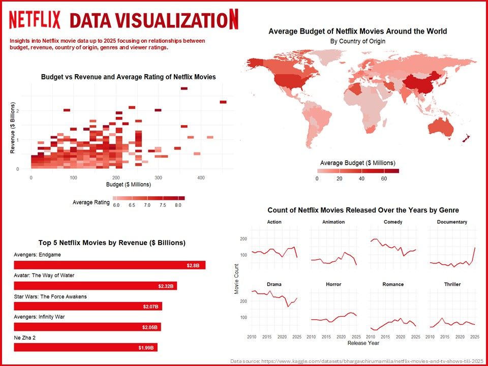
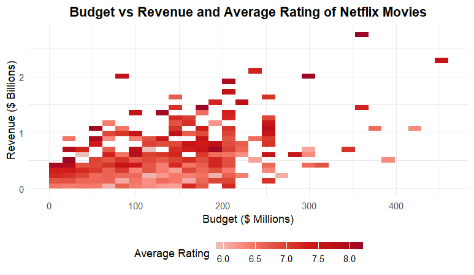

# Netflix Data Visualisation

## Summary
This project provides insights into Netflix movie data up to 2025, focusing on key factors like budget, genre, country of origin, and metrics like revenue and viewer ratings.  
Through a series of data visualizations, coded in R, we explore how these variables relate to each other and what patterns emerge from Netflix’s immense catalogue of movies.

## Tile Plot: Budget vs Revenue and Average Rating of Netflix Movies
This tile plot explores the relationship between movie budget and revenue, with color indicating average viewer rating.  
While there is a linear trend of higher budgets leading to higher revenues, the highest ratings are not limited to the most expensive productions, suggesting that cost does not always reflect quality.

